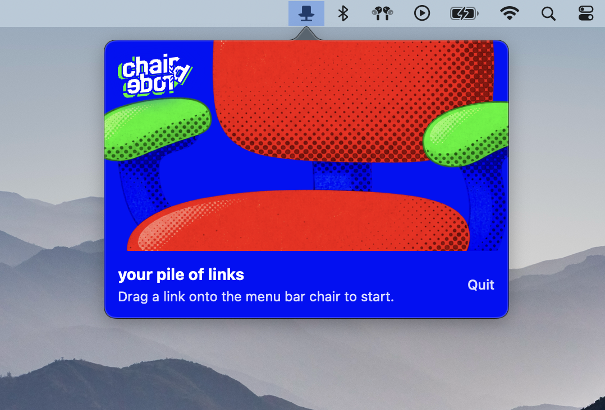
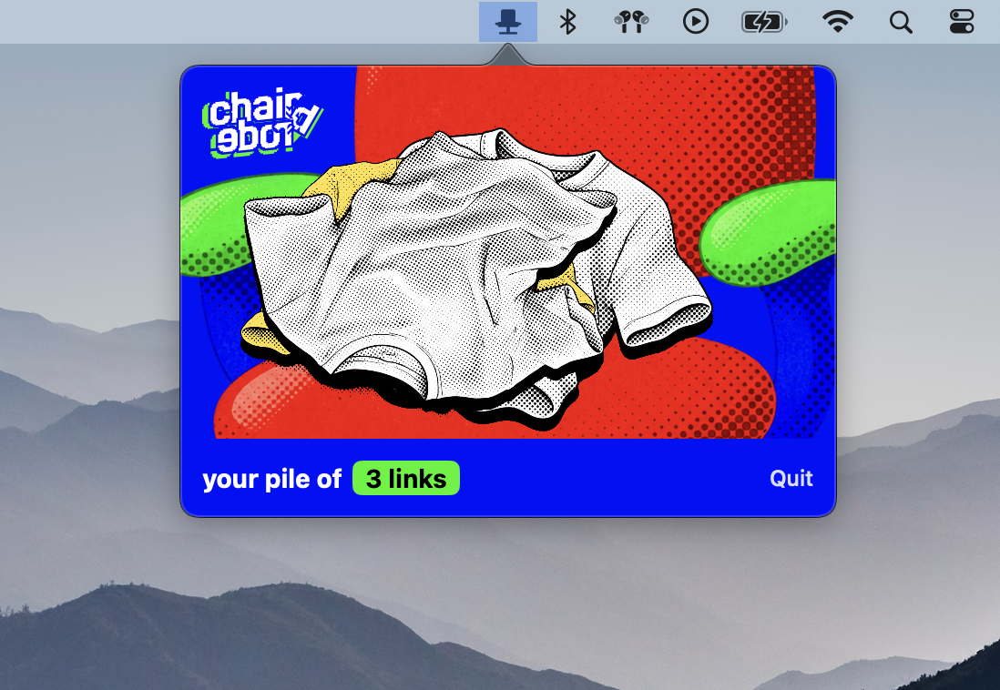
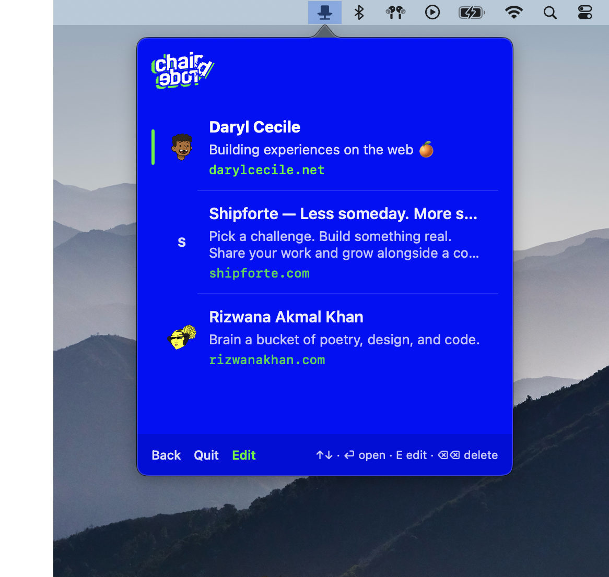
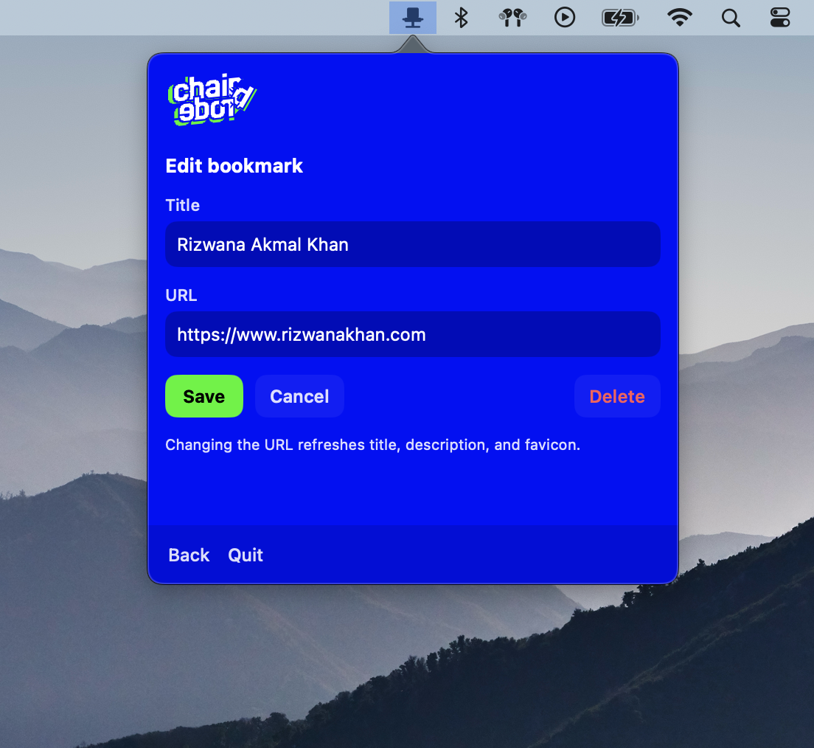
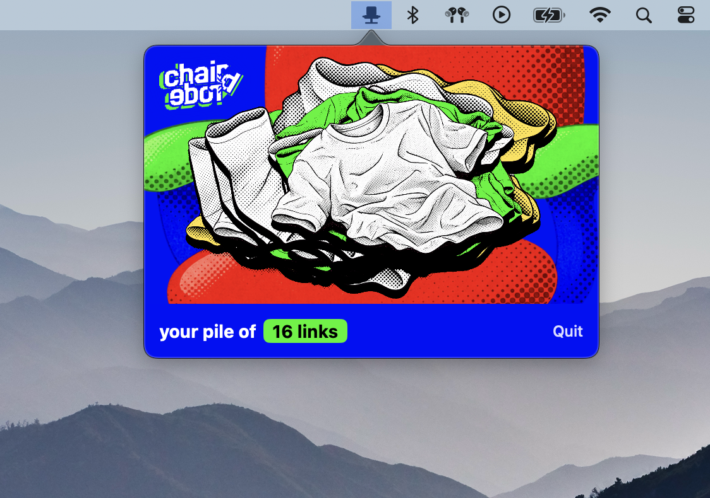

# chairdrobe

When your chair is more wardrobe than a chair, with a pile of clothes tossed onto it, it becomes a **chairdrobe**. And because art imitates life, you can now toss bookmarks to your chairdrobe, too.

## Requirements

- macOS 14.0 (Sonoma) or later
- Xcode 15.4+ (Swift 5.9+)

## Build & run

```bash
cd ~/Developer/chairdrobe
open chairdrobe.xcodeproj
```

In Xcode: select the **chairdrobe** scheme, then **Product → Run** (⌘R).

Or from the terminal:

```bash
xcodebuild -scheme chairdrobe -configuration Debug -derivedDataPath build
open build/Build/Products/Debug/chairdrobe.app
```

The app is a menu bar accessory (`LSUIElement`): no Dock icon. Look for the chair icon in the menu bar.

## How to use

1. Drag a link from your browser onto the menu bar chair icon to save it.
2. Click the icon to open your pile (popover).
3. Click / press Return to open a bookmark in your default browser.
4. Right-click a row (or press `E`) to edit; Delete removes it.
5. Bookmarks persist in `~/Library/Application Support/chairdrobe/bookmarks.json`.

## Configuration

- **Sandbox:** enabled, with outgoing network client access (for page title / description / favicon fetch).
- Saving a link never depends on metadata succeeding — if a site is down, the URL is still stored with a host fallback title.
- Duplicate http(s) URLs are not inserted again; you’ll see “Already in the pile”.

## Brand assets

Placeholder menu bar icon is a simplified chair template. Empty state uses the front-facing chair from `chairdrobe-assets`. Source exports live in `~/Developer/chairdrobe-assets`.

## Screenshots

Empty chair.



A small pile.



The list, with title, favicon, and description.



Edit a bookmark.



A bigger pile.


